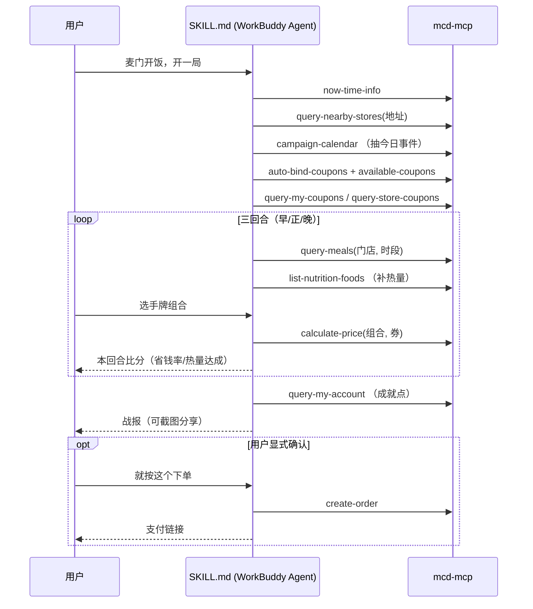

# MCP 集成说明 · MCP_INTEGRATION

本文说明「麦门开饭 McRogue」**实际使用**的麦当劳 MCP Server、Tool、调用流程与业务价值。

- **MCP Server**：`mcd-mcp`（麦当劳中国官方远程托管服务）
- **接入地址**：`https://mcp.mcd.cn`
- **传输协议**：Streamable HTTP
- **鉴权**：请求头 `Authorization: Bearer <MCD_MCP_TOKEN>`
- **官方开放平台**：<https://open.mcd.cn/mcp>

---

## 1. 为什么是"真调用"而不是"假演示"

McRogue 的全部数值来自 MCP 返回，本地不内置任何价格表或热量表：

| 游戏概念 | 真实来源 | 说明 |
|---|---|---|
| 当前是哪一餐 | `now-time-info` | 用官方时间判定早/正/晚，不读本地时钟 |
| 有哪些店 | `query-nearby-stores` | 由用户提供的地址决定，不写死 |
| 可抽的"手牌" | `query-meals` / `query-meal-detail` | 真实在售菜单与套餐组成 |
| 每张牌的热量 | `list-nutrition-foods` | 官方营养库 |
| "道具"（券） | `available-coupons` / `auto-bind-coupons` / `query-my-coupons` / `query-store-coupons` | 四路券池，含临期信息 |
| 结算金额 | `calculate-price` | **每一回合的最终比分都由官方算价产出** |
| 今日事件 | `campaign-calendar` | 当月营销活动日历 |
| 成就点 | `query-my-account` | 积分账户快照 |

---

## 2. 单局调用流程（时序）

---

## 3. 写入类操作的安全设计

只有 `create-order` / `cancel-order` 会改变真实世界状态，因此：

1. **默认不下单**：三回合结束只出"战报"，不产生任何订单；
2. **显式确认**：只有用户主动说「就按这个下单」才进入下单分支；
3. **先核价后下单**：下单前必定先跑一次 `calculate-price`，展示应付总额与优惠明细；
4. **无静默路径**：代码中不存在"条件满足即自动下单"的分支。

---

## 4. 频率与错误处理

- 官方限流为 **600 次/分钟**，单局调用量约 12~20 次，远低于阈值；
- 遇到 `401`：提示用户检查 Token 配置；
- 遇到 `429`：按官方建议退避重试，不并发轰炸。

---

## 5. 脱敏说明

- 配置文件仅使用环境变量占位符 `YOUR_MCP_TOKEN` / `${MCD_MCP_TOKEN}`；
- 仓库内不含任何真实 Token、门店地址、订单号或个人手机号；
- `data/snapshot.json` 为**公开菜单与营养的静态快照**，用于离线网页版演示，不含任何账户数据。
